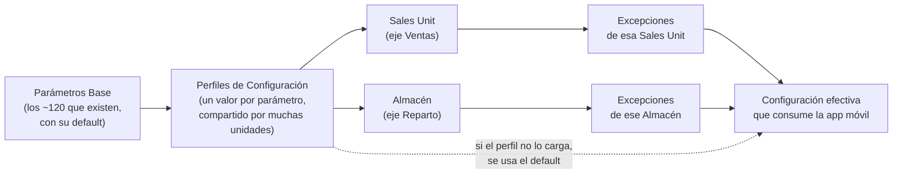

# SPEC-ADN-2209202601 — Configuración de Sales Unit (app móvil)

**Documento:** Explicación general · **Fase:** en definición.

## ¿Qué problema resuelve?

La app móvil necesita alrededor de 120 parámetros de configuración —
cosas como si muestra promociones, qué descuento máximo permite, si
pide firma en la entrega, etc. — tanto para la ruta de venta (Sales
Unit) como para la ruta de reparto (Almacén), de forma independiente:
una misma Sucursal puede necesitar una configuración distinta según
para cuál de las dos se esté armando la app. Hoy esos 120 valores
viven serializados en un XML por cada una. Con cerca de 1000 Sales
Unit activas, este esquema trae dos problemas reales: actualizar un
valor que comparten muchas unidades obliga a tocar el XML de cada una
por separado (o correr un UPDATE directo contra la base, que ya se
identificó como mala práctica), y armar un reporte de "qué unidades
tienen tal configuración" requiere parsear XML en vez de consultar una
tabla.

## ¿Cómo funciona, a grandes rasgos?

La idea central es que la mayoría de las Sales Unit comparten
exactamente la misma configuración entre sí — solo un grupo chico
tiene ajustes puntuales. En vez de guardar 120 valores por cada una,
el sistema separa "lo que se comparte" de "lo que se customiza":

En criollo: se parte de la lista cerrada de parámetros, se arman
perfiles con un valor para cada uno, y ese mismo perfil se puede
asignar tanto a una Sales Unit (ventas) como a un Almacén (reparto) —
son dos ejes independientes, cada uno con sus propias excepciones
puntuales. Cuando una unidad necesita algo distinto de su perfil se
anota la excepción; el resto sigue viniendo del perfil sin tocar nada
unidad por unidad.

Primero existe un catálogo único de **Parámetros Base** — la lista
cerrada de los ~120 parámetros que existen en el sistema, cada uno con
su tipo (sí/no, número, texto, etc.) y su valor por default. Es la
fuente de verdad de qué parámetros existen; nada en el resto del
sistema puede inventar un nombre de parámetro que no esté acá.

Sobre esa base se arman **Perfiles de Configuración** — por ejemplo
"Preventa Estándar" o "Autoventa CDMX" — cada uno con un valor
concreto para cada parámetro. Una Sales Unit o un Almacén se asignan a
UN perfil (cada eje por separado). Cuando alguien tiene que cambiar un
valor para 300 unidades que comparten el mismo perfil, edita el perfil
una sola vez y el cambio aplica a las 300 de una — sin tocar unidad
por unidad.

Para las pocas unidades que necesitan algo distinto de su perfil (un
descuento máximo especial que se negoció puntual, por ejemplo), existe
una tabla de **Excepciones** por Sales Unit/Almacén — solo se carga
ahí el parámetro que de verdad difiere, nunca los 120 completos. La
configuración final que consume la app móvil para una unidad puntual
se arma resolviendo en cascada: primero se busca si tiene una excepción
cargada para ese parámetro, si no la tiene se usa el valor de su
perfil, y si el perfil tampoco lo tiene cargado (un perfil puede estar
incompleto mientras se termina de armar) se usa el default del
Parámetro Base. Los dos ejes (ventas y reparto) se resuelven cada uno
por su cuenta, nunca se mezclan.

Como el catálogo de Parámetros Base es la única fuente de nombres
válidos, también sirve para validar dos cosas: que un Perfil esté
"completo" (tenga un valor cargado para cada parámetro base vivo, no
le falte ninguno) y que una Excepción solo pueda apuntar a un
parámetro que de verdad existe — nunca un texto libre tipeado a mano
que se puede desalinear del catálogo real.

## ¿Quién usa esta funcionalidad?

Gente de ADN (Administración de Negocio) arma y mantiene los
Parámetros Base y los Perfiles de Configuración, y asigna cada Sales
Unit/Almacén a su perfil correspondiente — nunca el usuario final de
la app móvil, que solo consume el resultado ya resuelto. Un
desarrollador de la app móvil consume la configuración efectiva por
Sales Unit o por Almacén vía la API del catálogo correspondiente, sin
necesitar saber si el valor vino de una excepción, del perfil o del
default.

## Lo que esta spec NO hace

No define la lista real de los ~120 parámetros de negocio (eso lo
carga ADN una vez armado el catálogo, no es parte del diseño técnico).
No cubre variabilidad de un parámetro por debajo de Sales Unit/Almacén
(por producto, turno, o usuario individual) — si aparece ese caso de
negocio real más adelante, se vuelve a esta spec primero para evaluar
si el modelo de Perfil+Excepción basta o hace falta un nivel más.
Tampoco resuelve una respuesta combinada de los dos ejes en una sola
llamada, ni decide todavía la pantalla/UI concreta de administración
(eso es `02.design.md`), ni migra los XML históricos ya guardados
(evaluar por separado como una tarea de migración de datos si hace
falta conservar el valor vigente de cada unidad existente).
