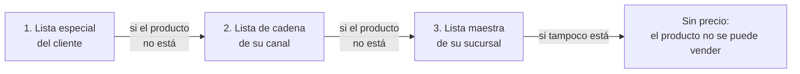

# SPEC-ADN-2909202601 — Lista de precios por canal ("lista de cadena")

**Documento:** Explicación general · **Fase:** en definición.

## ¿Qué problema resuelve?

Cuando se captura un pedido, el sistema tiene que saber qué precio
cobrar por cada producto, antes de descuentos e impuestos. Hoy un
cliente puede tener asignada una lista de precios especial, y cada
sucursal maneja sus propias listas, con una de ellas como su "lista
maestra". Falta un nivel intermedio: el **canal**. Muchos clientes
pertenecen a un mismo canal o cadena (por ejemplo, todas las tiendas
de una misma cadena de conveniencia) y comparten los precios negociados
con esa cadena. Sin este nivel hay dos malas opciones: asignarle la
misma lista especial a cada cliente de la cadena, uno por uno, o dejar
que les cobren el precio de la sucursal, que no es el negociado.

## ¿Cómo funciona, a grandes rasgos?

Cada canal puede tener asignada una **lista de precios de cadena**.
Esa lista es una lista de precios como cualquier otra (productos con su
precio por caja, sin impuestos). Lo nuevo es a quién se le asigna. El
precio de cada producto de un pedido se busca en cascada, del nivel más
particular al más general, y gana el primero que tenga ese producto:

La búsqueda es **producto por producto**, no lista por lista. Un
cliente con lista especial que solo incluye 5 productos negociados paga
esos 5 con su precio especial. El resto de lo que pide lo paga al
precio de su cadena y, si la cadena tampoco lo tiene, al de su
sucursal. Así nadie tiene que copiar el catálogo completo de precios en
cada lista: cada nivel solo guarda lo que realmente es distinto del
nivel de abajo.

Si un producto no aparece en ninguno de los tres niveles, el sistema
**no lo vende a precio cero**. Lo marca como "sin precio" para que
alguien corrija la lista que corresponde. Un precio en cero por
omisión es una pérdida silenciosa que nadie detecta hasta el cierre.

Cada pedido guarda de qué nivel y de qué lista salió el precio de cada
producto. Cuando alguien pregunta "¿por qué a este cliente se le cobró
este precio?", la respuesta está en el mismo pedido, sin reconstruirla.

## ¿Quién usa esta funcionalidad?

Gente de ADN (Administración de Negocio) arma las listas de precios y
asigna a cada canal su lista de cadena. El vendedor y la futura app
móvil no eligen la lista: reciben el precio ya resuelto al capturar el
pedido.

## Lo que esta spec NO hace

No define los descuentos (comercial y por volumen) ni el cálculo de
impuestos (IVA e IEPS): esos pasos vienen después de obtener el precio
base y son parte del modelo de precios completo, en su propia spec. No
cubre cómo se asignan las listas a una sucursal ni cuál es su lista
maestra, solo cómo participa esa lista maestra como último nivel de la
cascada. Tampoco agrega más niveles, como una lista maestra de toda la
empresa por debajo de la sucursal. Si más adelante se necesita, se
vuelve a esta spec para agregarlo como un nivel más de la misma
cascada.
